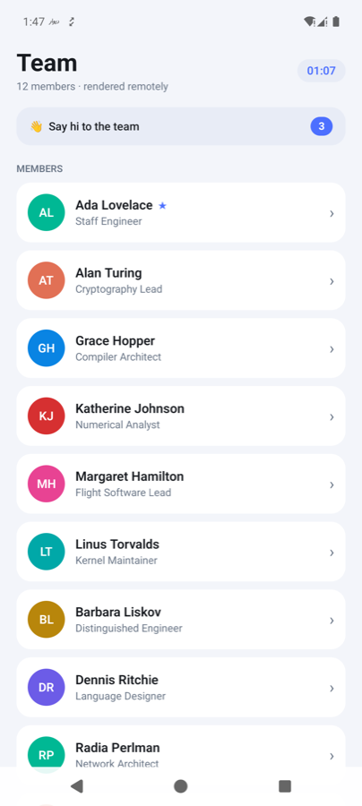
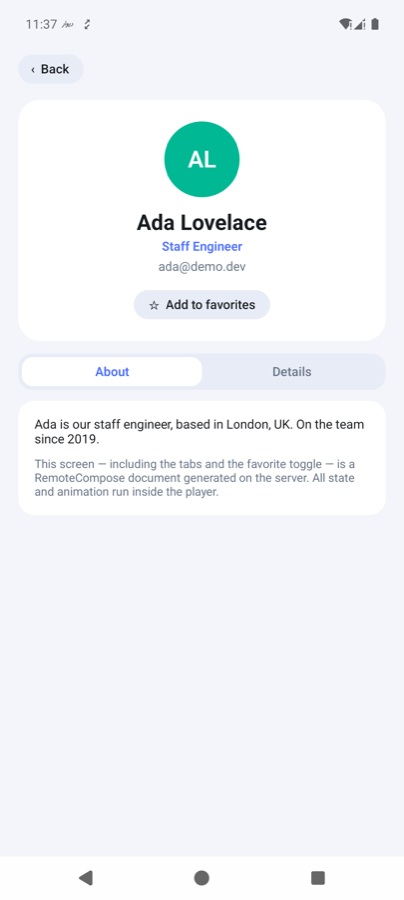
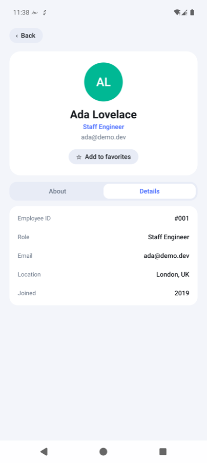
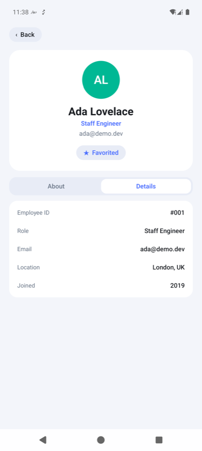

# RemoteCompose Demo — Server-Driven UI on Android

A working end-to-end demo of **AndroidX RemoteCompose**
([`androidx.compose.remote`](https://developer.android.com/jetpack/androidx/releases/compose-remote),
`1.0.0-alpha12`): a Kotlin/Ktor server *renders the UI* as compact binary
documents, and a thin Android app plays them — including **state, animations
and interactions that run entirely on the device**, with zero server
roundtrips after load.

| Team list | Profile · About | Profile · Details | Favorited |
|---|---|---|---|
|  |  |  |  |

Everything in these screenshots — cards, tabs, the favorite toggle, the tap
counter, the live clock, light/dark theming — is described by the **server**
in `rcBack/src/main/kotlin/Server.kt` and rendered by the RemoteCompose player
on the device.

## What it demonstrates

- **Server-driven UI**: the Android app ships no screen code for these
  screens; it fetches binary documents from `/ui/users` and `/ui/users/{id}`.
- **State inside the document**: the 👋 counter, the ★ favorite toggle and the
  About/Details tabs mutate document-local variables on tap (`setValue` +
  `StateLayout`) — instant, offline-capable interaction.
- **Host persistence loop**: every mutation also fires a named host action;
  the app mirrors the value (session memory for the counter, SharedPreferences
  for favorites) and feeds it back via query params so the next document is
  born with the right state.
- **Live expressions**: the header clock is an on-device expression
  (`hour()`/`minutes()` → formatted text).
- **Theming & fit**: themed light/dark colors resolve on the player; the
  client reports its viewport (dp + density) and the server sizes everything
  to match.

## Layout

```
rcBack/      Ktor 3.5 server (Kotlin 2.4, JVM 17) — creates the documents
rcClient/    Android app (AGP 9.2, compileSdk 37) — plays the documents
REMOTECOMPOSE.md            field guide: API notes, density model, 8 pitfalls
.claude/skills/remotecompose/  Claude Code skill distilled from the guide
```

## Run it

```bash
# 1. Server (port 8080)
cd rcBack && ./gradlew run

# 2. App (emulator reaches the host via 10.0.2.2)
cd rcClient && ./gradlew installDebug
```

## Read this before hacking on it

RemoteCompose is **experimental** — APIs change every alpha, and several
behaviors only fail on-device. [`REMOTECOMPOSE.md`](REMOTECOMPOSE.md)
documents what we learned the hard way, including:

- the player lays out *everything* (text included) in raw pixels — the
  dp/density handshake in this repo exists for that reason;
- `remoteThemedColor(Int, Int)` is broken at alpha12 (crashes the player);
- `HostAction` payloads are variable *ids*, not literals;
- without the `FEATURE_CLICK_VERSION=1` header, taps fire ~3×;
- `StateLayout` needs a `Box` wrapper inside `Column`s.

If you use Claude Code, the repo ships a
[`remotecompose` skill](.claude/skills/remotecompose/SKILL.md) so the
assistant knows all of this up front. It's also published standalone for use
in any project: https://github.com/&lt;you&gt;/remotecompose-skill
